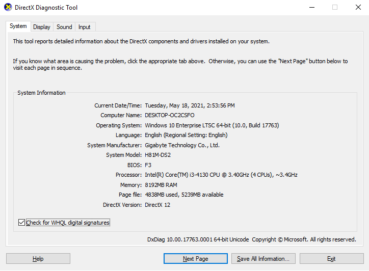
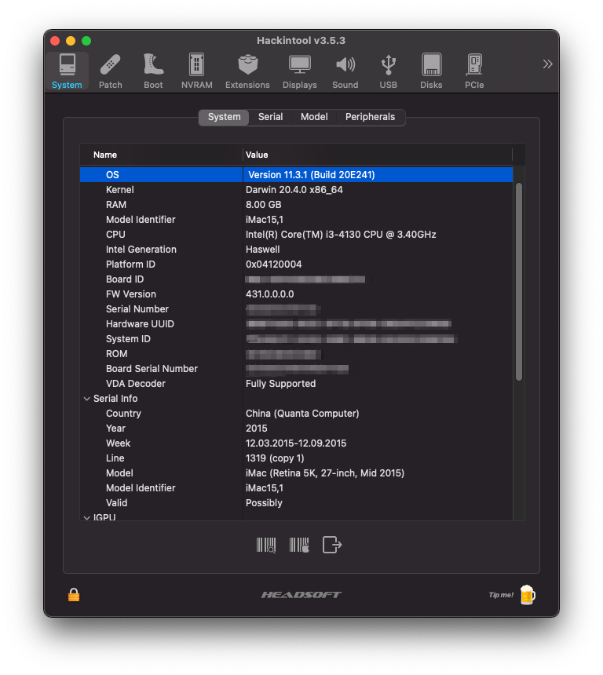

# H81M-DS2-HackintoshEFI

OpenCore EFI folder for mainboard Gigabyte H81M-DS2 (rev3.0)
Vietnamese version : [here](README_vi.md)

| Current installed  | OS(es) |
| ------------- | ------------- |
| ✅  | Windows 10  |
| ✅  | macOS Big Sur |

# My PC specification

| Part  | Info |
| ------------- | ------------- |
| Mainboard | Gigabyte H81M-DS2 (rev3.0), BIOS version F3  |
| CPU:  | Intel Core i3-4130 (Haswell, 3,40GHz, 2 core 4 thread)  |
| RAM:  | 8GB (2x4GB)  |
| GPU:  | NVIDIA Geforce GT 730 (GK208B, 128bit, 2GB GDDR5), natively support in Mojave, Catalina. |
| Disk:  | Netac SSD 128GB (macOS 11.3.1 installed, WD Blue 256GB (Windows 10 installed)  |
| Network: | Realtek RTL8111 |
| Sound:  | Realtek ALC887 (best layout-id in my build is 3)  |
| SMBIOS:  | iMac15,1  |

| Windows  | macOS |
| ------------- | ------------- |
|  |   |

# This specification was run

| Status  | Operating System & Version |
| ------------- | ------------- |
| ✅  | Latest Windows 10 build  |
| ✅  | macOS Big Sur  |
| ✅  | macOS Big Sur Beta 5  |
| ✅  | macOS Catalina |
| ✅  | macOS Mojave  |
| ✅  | macOS High Sierra  |
| ✅  | macOS Sierra  |
| ✅  | Mac OS X El Captain  |

# What is working
| Status  | Functions: |
| ------------- | ------------- |
| ✅  | Microphone (pink jack input)  |
| ✅  | Speaker (green jack input)  |
| ✅  | Ethernet (en0)  |
| ✅  | Services (App Store, Apple Music,...) |
| ✅  | Graphics card* |
| ✅  | Intel QuickSync/Hardware Acceleration |
| ✅  | USB 2.0/3.0  |
| ✅  | Bootcamp***  |

Notes: 
(*): GT730 (Kepler) is natively support in Catalina, other NVIDIA card please check before install Mojave or above.

# Not working
| Status  | Functions: |
| ------------- | ------------- |
| ❌  | iMessages, Facetime,...  |

Notes:
(***): If Bootcamp don't work in your machine, you need select another OS disk in UEFI settings to boot another OS.

# Guide for Low-end CPUs (Pentium, Celeron)
+ Because macOS don't support Pentium, Celeron CPUs, so we need a use the Fake CPUID and some changes, patches for that CPU to boot in MacOS:

Tutorial:
+ In your config.plist, goto Kernel > Emulate add these data into require value
```
CpuidData: A9060300 00000000 00000000 00000000
CpuidMask: FFFFFFFF 00000000 00000000 00000000
```
+ Enable Kernel > DummyPowerManagement
+ Disable NVRAM > WriteFlash
+ Replace HFSPlus.efi to [HFSPlusLegacy.efi](https://github.com/acidanthera/OcBinaryData/blob/master/Drivers/HfsPlusLegacy.efi)
+ Don't forget to take an OC Snapshot in ProperTree after you work with files!
+ Some problem are described/fix like this [Reddit](https://www.reddit.com/r/hackintosh/comments/gn41rk/stuck_in_oc_watchdog_status_is_0/) post.

# Notes
+ If you use GT730 2GB GDDR5 from Gigabyte like me, you should add agdpmod=pikera in boot-arg. That fix screen flash problem.

# Post-install:
+ (Only High Sierra) If you have NVIDIA graphics card, use this terminal command to install Web driver

```
bash <(curl -s https://raw.githubusercontent.com/Benjamin-Dobell/nvidia-update/master/nvidia-update.sh)
```
Code by [Benjamin-Dobell](https://github.com/Benjamin-Dobell/), use this [link](https://github.com/Benjamin-Dobell/nvidia-update/) to learn more.
+ (Only High Sierra) I installed CUDA driver too, get this in [here](https://www.nvidia.com/en-us/drivers/cuda/mac-driver-archive/)

# Credit
+ [hackintosh.vn](https://hackintosh.vn) for Vietnamese guides
+ [Olarila](https://olarila.com) for English guides, configs
+ [Benjamin-Dobell](https://github.com/Benjamin-Dobell/) for NVIDIA Web scripts
+ [Dortania](https://dortania.github.io/OpenCore-Install-Guide/) for OpenCore guides
